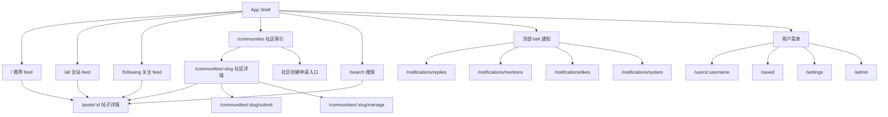

# 前端信息架构与页面拓扑蓝图

本文记录 `cumt-nexus-web` 重新设计前端网站前必须固定的页面拓扑、导航架构、URL 规则、登录态边界、内容模型和后端合同需求。

规划收口状态见 `docs/internal/product/frontend-planning-completion.md`。后续如果只是在实现、QA、上线或后端合同补齐中发现问题，应更新对应执行文档或后端缺口记录，不再重新打开本文的基础拓扑讨论。

它回答的问题不是“某个按钮怎么改”，而是：

- 一个健康的社区前端应该如何组织首页、社区、搜索、帖子、评论、通知、申请和管理入口。
- 哪些页面应该共享同一套 App Shell。
- 未登录用户可以看什么、不能做什么。
- 帖子详情应该如何返回来路。
- 哪些能力必须要求后端补齐，前端不能伪造。

本文是目标蓝图，不做分阶段弱化版本。后续 AI 实现时仍必须按 `AGENTS.md` 的完整功能任务执行，但所有任务都要收敛到本文的同一个目标形态。

## 设计基准

长期视觉方向继续沿用：

```text
dark editorial product / magazine-grade campus community interface
```

含义：

- 不换技术栈。
- 不新增第二套 UI 库。
- 不把每个页面做成不同风格。
- 不做营销型首页。
- 不用大面积炫技背景、光污染和随机审美。
- 所有用户可见固定文案默认使用简体中文。
- 借鉴 Reddit 的信息架构、URL 和社区浏览模式，但不照搬 Reddit 的视觉皮肤。
- 借鉴 Bilibili 的通知分类体验，但不照搬 Bilibili 的视觉皮肤。

成熟社区产品的共同做法：

- 先固定全站骨架，再填页面内容。
- 全站搜索、通知、账号菜单放在顶部 bar。
- 全局主导航保持稳定，不因为进入搜索、通知或社区页就换一套结构。
- 信息流、社区流和关注流只是不同数据源，不应该变成不同产品。
- 帖子详情是阅读层，返回应优先回到用户刚才的浏览来源。
- URL 代表可分享资源，短期浏览来源优先用浏览器 history 或 session state 保存。
- 管理入口和普通浏览入口分离，避免把审核、申请、通知塞进同一个左侧栏。

## 当前主要问题

### 1. 未登录首页不可读

当前问题：

- 未登录用户无法像正常社区产品一样先浏览公开信息流。
- 首页容易把“读内容”和“登录后才能写操作”混在一起。
- 这会让用户在没有理解产品内容前就被迫登录。

目标：

- 未登录可以看推荐 feed、全站 feed、社区、帖子、评论、搜索和用户主页。
- 未登录不能发帖、评论、投票、举报、通知、申请、审核和管理。
- 写操作入口可以展示，但点击后进入登录门禁，并保留安全回跳。

### 2. App Shell 不统一

当前问题：

- 首页有一套左侧栏和顶部 bar。
- 社区页、搜索页、通知页使用另一套顶部 `PageNav`。
- 用户在不同页面之间切换时，主导航位置、视觉权重和页面骨架都变化。
- 左侧栏目不应该时有时无；要么稳定展开，要么在同一套状态下收起。

目标：

- 首页、全站流、关注流、社区列表、社区详情、搜索、通知、帖子详情、发帖、申请和管理都接入同一套 App Shell。
- 桌面端左侧栏常驻。
- 移动端左侧栏收进统一 drawer/sheet。
- 顶部 bar 常驻搜索、通知、发帖入口和用户菜单。

### 3. 顶部 bar 和左侧栏职责混乱

当前问题：

- 通知、申请、审核等入口容易被放进左侧导航，导致左栏越来越像杂物架。
- 搜索如果只是一个跳转按钮，而不是输入框，会让用户感觉被迫进入另一个页面再搜索。
- 审核和申请入口没有区分普通用户、社区功能和平台管理。

目标：

- 顶部 bar：当前页面上下文、全站搜索输入框、发帖入口、通知、头像菜单或登录注册。
- 左侧栏上方：`首页`、`全站`、`关注`、`社区`。
- 左侧栏下方：最近访问社区，后续再加关注社区。
- 通知：顶部头像旁的 bell。
- 社区申请：只在 `/communities` 页面作为社区功能按钮。
- 平台管理：只在有权限的用户菜单里出现。
- 社区管理：只在对应社区页面按权限出现。

### 4. 帖子详情返回不健康

当前问题：

- 从首页 feed 点进帖子详情后，返回按钮可能固定指向社区索引。
- 这不符合真实浏览路径，也会破坏用户连续阅读。

目标：

- 从首页进入详情，返回首页 feed 并尽量保留滚动位置。
- 从全站流进入详情，返回全站流。
- 从关注流进入详情，返回关注流。
- 从社区进入详情，返回所属社区。
- 从搜索进入详情，返回搜索结果并保留 query。
- 没有来源记录时，返回所属社区，而不是 `/`。
- 不在公开 URL 上暴露 `return_to`。来源记录优先使用浏览器 history、sessionStorage 或客户端 route state。

### 5. URL 和排序不统一

当前问题：

- 信息流 sort、评论 sort、搜索 query 容易全部混成 query 参数。
- 后续扩展 `best/hot/new/top/rising` 时会缺少清晰 URL 规则。

目标：

- 信息流 sort 使用路径。
- 评论 sort 使用 query。
- 搜索关键词和 scope 使用 query。
- 资源 URL 保持稳定可分享。

### 6. 内容模型不合理

当前问题：

- 图片像是挂在帖子和评论正文外面的附件。
- 图文、外链、embed、摘要和正文之间没有形成统一内容模型。

目标：

- 帖子和评论使用同一套正文模型。
- 正文以 `nexus_markdown` 保存和渲染。
- 图片、普通链接和白名单 embed 都作为正文内的内容引用出现。
- 原生视频暂不做，只支持外链 Bilibili、抖音、网易云音乐、QQ 音乐等白名单 embed。
- 投票、问答、攻略贴等扩展以后作为内容工具插入，不影响当前基础模型。

### 7. 作者和社区展示信息太贫瘠

当前问题：

- 如果页面展示 raw id、短 UUID 或缺少头像昵称，会显得像后台系统。

目标：

- 社区在 UI 中展示头像、banner、名称、slug、简介和统计。
- 作者展示昵称、头像、用户名、签名、徽章、角色和后续“漂亮信息”。
- `id` 只作为内部稳定标识，不作为用户主要可见信息。

## 账号与权限边界

### 未登录可读

未登录用户可以访问：

```text
/
/all
/all/:sort
/communities
/communities/:slug
/communities/:slug/:sort
/posts/:id
/search
/users/:username
```

未登录用户可以做：

- 浏览推荐信息流。
- 浏览全站信息流。
- 浏览社区列表。
- 浏览社区详情和社区帖子。
- 浏览帖子详情。
- 浏览评论树。
- 搜索社区和帖子。
- 打开公开用户主页。
- 复制帖子链接。

### 未登录禁止

未登录用户不能做：

- 发帖。
- 评论。
- 回复。
- 编辑。
- 删除。
- 投票。
- 保存收藏。
- 举报。
- 查看通知。
- 提交社区申请。
- 审核。
- 平台管理。
- 社区管理。
- 上传图片或解析受保护内容。

这些入口的表现：

- 可以展示登录引导。
- 点击后进入 `/login?next=...` 或 `/register?next=...`。
- `next` 只允许站内安全路径。
- 不能因为未登录在公开阅读页展示接口错误面板。

### 登录后可用

登录用户可以额外访问：

```text
/following
/following/:sort
/submit
/communities/:slug/submit
/notifications/replies
/notifications/mentions
/notifications/likes
/notifications/system
/saved
/settings
/settings/profile
/settings/account
/settings/notifications
```

登录用户可以做：

- 发帖。
- 评论。
- 回复。
- 投票。
- 保存收藏。
- 举报。
- 查看通知。
- 编辑和删除自己的内容。
- 提交社区申请。
- 管理自己的资料和设置。

### 平台管理员

平台管理员入口只从用户菜单出现。

路由：

```text
/admin
/admin/reports
/admin/community-applications
/admin/users
/admin/communities
/admin/effects
/admin/settings
```

平台管理员能力：

- 处理全站举报。
- 审核社区申请。
- 管理用户。
- 管理社区。
- 管理全站积分、效果、贴图和系统设置。

### 社区管理员和版主

社区管理入口只在对应社区内按权限出现。

路由：

```text
/communities/:slug/manage
/communities/:slug/manage/reports
/communities/:slug/manage/posts
/communities/:slug/manage/comments
/communities/:slug/manage/members
/communities/:slug/manage/settings
/communities/:slug/manage/rules
```

社区管理能力：

- 处理本社区举报。
- 管理本社区帖子和评论。
- 管理成员。
- 管理规则。
- 管理社区设置。

## 全站 App Shell

### 桌面端结构

```text
┌──────────────────────────────────────────────────────────────┐
│ Top Bar: context/back, search input, submit, bell, user menu │
├───────────────┬───────────────────────────────┬──────────────┤
│ Left Sidebar  │ Main Content                  │ Right Rail   │
│ Home          │ feed/list/detail/form/manage  │ optional     │
│ All           │                               │ context      │
│ Following     │                               │              │
│ Communities   │                               │              │
│               │                               │              │
│ Recent        │                               │              │
│ Communities   │                               │              │
└───────────────┴───────────────────────────────┴──────────────┘
```

桌面规则：

- 左侧栏常驻。
- 当前路由高亮。
- 左侧上方只放全局浏览入口。
- 左侧下方先放最近访问社区，后续再放关注社区。
- 顶部搜索输入框常驻。
- 通知 bell 放在用户头像附近。
- 发帖入口放在顶部 bar。
- 右侧栏只放当前页面上下文，不做全站主导航。

### 移动端结构

```text
┌──────────────────────────────────────┐
│ Top Bar: menu, search, submit, bell  │
├──────────────────────────────────────┤
│ Main Content                         │
└──────────────────────────────────────┘
```

移动端规则：

- 顶部搜索输入框仍常驻。
- 左侧栏进入 drawer/sheet。
- 顶部项目少，不需要移除搜索。
- 触控目标稳定，不靠极小文字链接承载主命令。
- 右侧栏内容下沉到主内容之后。

### 顶部 bar 组成

左侧：

- 当前页面上下文。
- 详情页可显示返回上级的局部入口。
- 不承担全站主导航。

中间：

- 搜索输入框。
- 输入时可以显示建议。
- 回车或选择建议进入 `/search?q=...`。
- 不做“一点输入框就立即跳搜索页”的体验。

右侧：

- 发帖入口。
- 通知 bell。
- 用户菜单或登录注册。

### 左侧栏组成

上方固定：

```text
首页       /
全站       /all
关注       /following      登录后显示，未登录可以显示但点击登录
社区       /communities
```

下方动态：

```text
最近访问社区
- :community_slug
- :community_slug
- :community_slug

关注的社区
- 后续接入
```

当前先实现最近访问社区：

- 前端 localStorage 记录。
- 点击社区详情和社区帖子时更新。
- 至多显示固定数量。
- 不依赖后端。

后续关注社区：

- 登录后从后端读取。
- 未登录不显示或显示登录引导。

## URL 拓扑

### 信息流

```text
/                       推荐 feed
/hot                    推荐 feed hot
/new                    推荐 feed new
/top?t=week             推荐 feed top
/rising                 推荐 feed rising

/all                    全站 feed 默认 best
/all/hot                全站 feed hot
/all/new                全站 feed new
/all/top?t=week         全站 feed top
/all/rising             全站 feed rising

/following              关注 feed 默认 best
/following/hot          关注 feed hot
/following/new          关注 feed new
/following/top?t=week   关注 feed top
/following/rising       关注 feed rising
```

规则：

- `/` 是推荐首页，不重定向到 `/all`。
- 未登录访问 `/` 时使用公开推荐 feed。
- `/all` 是全站公开信息流。
- `/following` 需要登录。
- sort 使用路径。
- `top` 的时间范围使用 query：`t=day|week|month|year|all`。

### 社区

```text
/communities
/communities/:slug
/communities/:slug/hot
/communities/:slug/new
/communities/:slug/top?t=week
/communities/:slug/rising
/communities/:slug/submit
/communities/:slug/manage
```

规则：

- `slug` 是 URL 中的人类可读社区标识。
- `id` 是后端内部稳定标识，不进入普通 URL。
- 社区申请创建入口只放在 `/communities`。
- 社区管理入口只在有权限的社区详情中出现。

### 帖子

```text
/posts/:id
/posts/:id?sort=best
/posts/:id?sort=top
/posts/:id?sort=new
/posts/:id?sort=old
/posts/:id?sort=controversial
```

规则：

- 当前帖子详情继续保留 `/posts/:id`。
- 评论排序使用 query。
- 帖子详情不在公开 URL 上增加 `return_to`。
- 来源记录由 history、sessionStorage 或客户端 route state 管理。
- 来源缺失时返回所属社区。

后续如果要改成更漂亮的帖子 URL，可以另开设计讨论，例如：

```text
/communities/:slug/posts/:id/:title_slug
```

但当前目标不要求改变帖子 URL。

### 搜索

```text
/search?q=关键词
/search?q=关键词&scope=all
/search?q=关键词&scope=communities
/search?q=关键词&scope=posts
```

规则：

- 搜索词和 scope 使用 query。
- 搜索输入框常驻顶部 bar。
- 搜索页展示完整结果。
- 空关键词不发起搜索。

### 用户

```text
/users/:username
/users/:username/posts
/users/:username/comments
/users/:username/communities
/saved
/settings
/settings/profile
/settings/account
/settings/notifications
```

规则：

- 用户主页公开可读。
- 未登录可以看公开资料、公开帖子、公开评论和公开社区。
- 设置和收藏需要登录。
- UI 展示昵称、头像、用户名、签名、徽章和角色，不展示 raw user id。

### 通知

```text
/notifications/replies
/notifications/mentions
/notifications/likes
/notifications/system
```

规则：

- 通知不放左侧栏。
- 通知入口在顶部 bell。
- bell 显示未读总数。
- 点击可以打开 popover，也可以进入通知中心。
- 通知中心按回复、@、赞、系统分类展示。

### 发布

```text
/submit
/communities/:slug/submit
```

规则：

- 顶部发帖入口指向 `/submit`。
- `/submit` 先选择社区，再进入写作。
- 在社区内点击发帖，直接进入 `/communities/:slug/submit`。
- 未登录点击发帖进入登录门禁。
- 旧路由 `/communities/:slug/new` 可以保留兼容，但目标入口使用 `/submit` 和 `/communities/:slug/submit`。

## 信息流模型

### Feed 来源

```text
recommendation_feed  -> /
global_feed          -> /all
following_feed       -> /following
community_feed       -> /communities/:slug
search_results       -> /search
profile_posts        -> /users/:username/posts
saved_posts          -> /saved
```

所有 feed 共用：

- 同一套列表骨架。
- 同一套帖子卡片。
- 同一套 loading、empty、error。
- 同一套 sort 控件。
- 不同的 query key 和 API source。

### Feed sort

目标 sort：

```text
best
hot
new
top
rising
```

说明：

- `best`：默认推荐或综合排序。
- `hot`：热度。
- `new`：最新。
- `top`：高分，带时间范围。
- `rising`：上升趋势。

前端不自己发明排序算法。后端返回什么，前端展示什么。

### Feed item 展示

Feed item 必须展示：

- 社区。
- 作者。
- 标题。
- 正文摘要。
- 图片预览或链接预览。
- 投票按钮。
- 评论数量。
- 分享。
- 收藏。
- 更多操作。

桌面端：

- 保持 editorial dense feed。
- 信息密度较高，便于扫读。
- 不做一屏一帖。

移动端：

- 更接近卡片化和沉浸阅读。
- 但仍不是抖音式单帖全屏。
- 按钮固定尺寸，避免因为文本变化挤压。

### 首页推荐目标

首页 `/` 是推荐 feed。

短期：

- 未登录使用公开推荐或公开全站 best。
- 登录后使用后端提供的推荐源。

长期：

- 推荐目标类似抖音或 Bilibili 的推送模式。
- 但当前前端只定义页面与接口边界，不实现推荐算法。

同时保留：

- `/all` 全站信息流。
- `/following` 关注信息流。

## 帖子详情返回模型

### 来源记录

前端进入帖子详情时记录来源：

```text
feed:/?sort=best
feed:/all/hot
feed:/following
community:/communities/:slug
search:/search?q=...&scope=posts
profile:/users/:username/posts
saved:/saved
```

记录方式：

- 浏览器 history state。
- sessionStorage keyed by post id。
- TanStack Query 或 router 层的轻量 source state。

不使用：

- 公开 URL query `return_to`。
- 任意外部 URL。
- 没有白名单校验的 redirect path。

### 返回文案

按来源显示：

```text
返回首页
返回全站
返回关注
返回社区
返回搜索结果
返回用户主页
返回收藏
```

来源缺失：

- 使用帖子响应中的 `community.slug`。
- 返回 `/communities/:slug`。
- 如果帖子响应没有社区 slug，则显示“查看所属社区”不可用状态，并保留全局导航。

### 滚动恢复

目标：

- 从 feed 进入详情后，返回时尽量恢复列表滚动位置。
- 来源记录只负责用户体验，不改变资源 URL。
- SSR 和首屏可分享性不依赖来源记录。

## Slug、ID 和标题

### ID

`id` 是后端内部稳定标识。

用途：

- 数据库主键。
- API 写操作。
- 缓存 key。
- 权限判断。

UI 规则：

- 不把 UUID 或短 ID 作为普通用户主要展示内容。
- 可在管理后台或调试信息中展示。

### Slug

`slug` 是 URL 里的短标识。

用途：

- 社区 URL。
- 可读、可分享、可记忆。
- 例如 `/communities/cs101`。

规则：

- slug 需要全局唯一。
- slug 不等于展示名称。
- 展示名称可以改，slug 改动需要重定向或谨慎处理。

### Display name

展示名称用于 UI。

社区：

- `name` 是显示名称。
- `slug` 是 URL 标识。
- `id` 是内部标识。

用户：

- `username` 是用户主页 URL 标识。
- `display_name` 是显示昵称。
- `id` 是内部标识。

## 内容模型

### 正文格式

帖子和评论使用同一套正文格式：

```text
format: nexus_markdown
body: string
content_refs: image | link_preview | embed
```

正文示例：

```markdown
今天整理一下选课经验。


这个视频讲得不错：
https://www.bilibili.com/video/BV...
```

渲染规则：

- Markdown 仍走安全 renderer。
- 图片引用由后端返回的 attachment id 解析。
- 普通链接渲染链接预览卡。
- 白名单媒体链接渲染受控 embed。
- 不渲染用户 HTML。
- 不开放任意 iframe。

### 支持的正文能力

帖子支持：

- Markdown 文本。
- 内联图片。
- 普通外链。
- 普通链接预览。
- Bilibili 外链 embed。
- 抖音外链 embed。
- 网易云音乐外链 embed。
- QQ 音乐外链 embed。

评论支持：

- Markdown 文本。
- 内联图片。
- 普通外链。
- 普通链接预览。
- 同一批白名单 embed。

暂不支持：

- 原生视频上传。
- 任意 HTML。
- 任意 iframe。
- 投票工具。
- 问答工具。
- 攻略贴专属结构。

这些以后作为工具插入正文，不改变基础模型。

### 写作器

目标写作器：

- textarea 或 composer 为主体。
- 顶部或底部工具栏提供格式动作。
- 图片上传后插入正文引用。
- 粘贴链接后显示 inline preview block。
- 白名单链接显示 inline embed preview。
- 保存时仍提交 `nexus_markdown` 和结构化 refs。

不做：

- Notion 式完整 block editor。
- 纯 `body + attachment_ids` 的正文外附件模型。
- 编辑和预览完全割裂的双 tab 体验。

## 评论模型

评论采用树状结构。

目标：

- 根评论和回复共用同一内容模型。
- 评论支持 Markdown、图片、链接和白名单 embed。
- 评论有 upvote、downvote、score 和 `my_vote`。
- 评论排序用 query。
- 移动端缩进有上限，深层评论用折叠和线条保持可读。

评论排序：

```text
sort=best
sort=top
sort=new
sort=old
sort=controversial
```

未来扩展：

- 专属积分贴图。
- 评论特效。
- 趣味身份效果。
- 这些必须有后端积分扣减、库存、权限和审计，不由前端伪造。

## 通知模型

目标借鉴 Bilibili 分类通知。

分类：

```text
回复
@
赞
系统通知
```

顶部 bell：

- 显示未读总数。
- 可以显示分类未读摘要。
- 点击打开 popover 或跳通知中心。

通知页：

- `/notifications/replies`
- `/notifications/mentions`
- `/notifications/likes`
- `/notifications/system`

交互：

- 分类 tab。
- 未读状态。
- 标记已读。
- 全部标记已读。
- 保守跳转到帖子、评论、社区或系统目标。

## 用户菜单

未登录：

```text
登录
注册
```

已登录：

```text
我的主页
我的收藏
通知
个人设置
平台管理      仅 platform admin 显示
退出登录
```

规则：

- 社区申请不放用户菜单。
- 社区管理不放用户菜单。
- 审核入口不放左侧栏。
- 平台管理仅有权限时显示。

## 社区页面入口

`/communities` 页面提供：

- 社区列表。
- 搜索或筛选社区。
- 创建社区申请入口。

创建社区申请入口：

- 是社区页功能。
- 不放左侧栏。
- 不放用户菜单。
- 未登录点击进入登录门禁。

社区详情提供：

- 社区头像。
- 社区 banner。
- 社区名称。
- slug。
- 简介。
- 成员数。
- 帖子数。
- 关注按钮。
- 发帖按钮。
- 当前用户在社区中的角色或权限。
- 有权限时显示社区管理入口。

## 管理拓扑

### 平台管理

平台管理是站点级后台。

入口：

- 用户菜单里的 `平台管理`。

路由：

```text
/admin
/admin/reports
/admin/community-applications
/admin/users
/admin/communities
/admin/effects
/admin/settings
```

页面骨架：

- 使用管理专用二级导航。
- 不混入普通左侧栏的主浏览入口。
- 但仍保留全站顶部 bar 和账号状态。

### 社区管理

社区管理是板块级后台。

入口：

- 社区详情页的 `管理社区`。

路由：

```text
/communities/:slug/manage
/communities/:slug/manage/reports
/communities/:slug/manage/posts
/communities/:slug/manage/comments
/communities/:slug/manage/members
/communities/:slug/manage/settings
/communities/:slug/manage/rules
```

页面骨架：

- 使用社区管理二级导航。
- 明确当前管理的社区。
- 所有权限由后端 `viewer_permissions` 兜底。

## 后端目标合同

本节只记录前端需要后端提供什么，不直接修改后端实现。

### 公开读取和可选认证

需要：

```text
GET /api/v1/posts?source=recommended&sort=best|hot|new|top|rising&t=...
GET /api/v1/posts?source=all&sort=best|hot|new|top|rising&t=...
GET /api/v1/communities/:slug/posts?sort=best|hot|new|top|rising&t=...
GET /api/v1/posts/:id
GET /api/v1/posts/:id/comments?sort=best|top|new|old|controversial
GET /api/v1/communities
GET /api/v1/communities/:slug
GET /api/v1/search?q=...&scope=all|communities|posts
GET /api/v1/users/:username
GET /api/v1/users/:username/posts
GET /api/v1/users/:username/comments
```

规则：

- 上述公开读取接口支持无 token。
- 无 token 时返回公开数据。
- 有有效 token 时返回 viewer context。
- 无效 token 返回 `unauthenticated`，不要静默当游客。
- 写操作继续强制 Bearer。

### Feed 响应字段

帖子列表项需要：

```text
id
title
body_excerpt
format
community.id
community.slug
community.name
community.avatar_url
author.id
author.username
author.display_name
author.avatar_url
author.headline
author.badges
score
upvote_count
downvote_count
comment_count
save_count
my_vote
is_saved
preview.kind
preview.image
preview.link
preview.embed
created_at
updated_at
```

### 帖子详情字段

需要：

```text
id
title
body
format=nexus_markdown
content_refs
community summary
author summary
score
upvote_count
downvote_count
comment_count
save_count
my_vote
is_saved
viewer_permissions
created_at
updated_at
```

### 评论字段

需要：

```text
id
post_id
parent_id
body
format=nexus_markdown
content_refs
author summary
score
upvote_count
downvote_count
my_vote
viewer_permissions
created_at
updated_at
children
```

### 社区字段

需要：

```text
id
slug
name
description
avatar_url
banner_url
member_count
post_count
viewer_is_following
viewer_role
viewer_permissions
created_at
```

### 用户字段

需要：

```text
id
username
display_name
avatar_url
headline
bio
badges
roles
stats
created_at
```

### 保存收藏

需要：

```text
POST   /api/v1/posts/:id/save
DELETE /api/v1/posts/:id/save
GET    /api/v1/me/saved-posts
```

响应和列表字段：

```text
is_saved
save_count
```

### 社区关注

需要：

```text
GET    /api/v1/me/followed-communities
POST   /api/v1/communities/:slug/follow
DELETE /api/v1/communities/:slug/follow
```

### 评论投票

需要：

```text
PUT    /api/v1/comments/:id/vote
DELETE /api/v1/comments/:id/vote
```

字段：

```text
upvote_count
downvote_count
score
my_vote
```

### 通知

需要：

```text
GET  /api/v1/notifications/unread-summary
GET  /api/v1/notifications?category=replies|mentions|likes|system&status=all|unread|read
POST /api/v1/notifications/:id/read
POST /api/v1/notifications/read-all
```

未读摘要：

```text
total
replies
mentions
likes
system
```

通知字段：

```text
id
category
actor summary
target_type
target_id
target_url
text
is_read
created_at
```

赞通知应支持聚合，避免一条赞一个通知把列表打爆。

### 内容引用

需要：

```text
POST /api/v1/uploads/images
POST /api/v1/link-previews/resolve
POST /api/v1/embeds/resolve
```

白名单 provider：

```text
bilibili_video
douyin_video
netease_music
qq_music
```

后端必须负责：

- URL 解析。
- provider 识别。
- SSRF 防护。
- iframe 白名单。
- 对象存储。
- 图片校验。
- 临时附件清理。

前端只渲染后端返回的结构化结果。

### 管理和权限

需要：

```text
GET /api/v1/me
GET /api/v1/admin/...
GET /api/v1/communities/:slug/manage/...
```

`GET /api/v1/me` 至少需要：

```text
is_platform_staff
permissions
```

社区详情和管理接口需要：

```text
viewer_role
viewer_permissions
```

前端入口显隐只做体验优化，真正权限以后端为准。

### 积分和评论效果

未来需要：

```text
GET  /api/v1/effects/catalog
POST /api/v1/comments/:id/effects
GET  /api/v1/me/points
```

后端必须保证：

- 积分扣减。
- 库存或限购。
- 权限。
- 审计记录。
- 失败回滚。

该能力不阻塞当前前端拓扑。

## 前端代码组织目标

路由层：

```text
src/app/
```

只负责路由、metadata、layout 和页面组合。

App Shell：

```text
src/components/app-shell/
```

负责：

- 顶部 bar。
- 左侧栏。
- 移动端 drawer。
- 用户菜单。
- 通知入口。
- 最近访问社区。
- 全站搜索输入框。

基础 UI：

```text
src/components/ui/
```

只放 shadcn/ui 基础件和本项目封装后的基础件。

业务组件：

```text
src/components/post/
src/components/community/
src/components/comment/
```

负责跨 feature 的展示组件，不直接写后端 URL。

业务逻辑：

```text
src/features/feed/
src/features/post/
src/features/community/
src/features/comment/
src/features/search/
src/features/notification/
src/features/auth/
src/features/profile/
src/features/moderation/
```

负责 query、mutation、schema、类型和页面组合逻辑。

HTTP：

```text
src/lib/api/
```

唯一 HTTP client 入口。

Auth：

```text
src/lib/auth/
```

唯一 token/session 读写入口。

Query：

```text
src/lib/query/
```

TanStack Query provider、query key 和通用配置。

## Mermaid 拓扑图



## 验收标准

完成本文目标后，至少应满足：

- 未登录打开 `/` 能看到公开 feed。
- 未登录能打开社区、帖子、评论、搜索、用户主页。
- 未登录点击发帖、评论、投票、保存、通知、申请和管理时进入清楚的登录门禁。
- 首页、全站、关注、社区、搜索、通知和帖子详情共享同一 App Shell。
- 顶部搜索输入框在桌面和移动端常驻。
- 通知只在顶部 bell 和通知中心出现。
- 社区申请只在 `/communities` 出现。
- 审核和管理入口不在普通左侧栏出现。
- 帖子详情能按来源返回；来源缺失时回到所属社区。
- 信息流 sort 使用路径。
- 评论 sort 使用 query。
- feed item 展示社区、作者、标题、互动按钮、图片或链接预览、正文摘要。
- 帖子和评论使用同一内容模型。
- 作者和社区展示头像、昵称、slug、徽章和角色，不把 raw id 当主要 UI。
- 平台管理和社区管理入口分离。
- 所有后端缺口已写入文档，前端没有伪造未完成能力。

## 后续派工方式

用户后续可以按真实页面反馈派工：

```text
按 docs/internal/product/frontend-information-architecture.md 的目标，修 [页面/路径]。
我的体验反馈是：
1. ...
2. ...

只做这个任务。不要改后端实现；需要后端补什么写进文档。
```

AI 必须：

- 先核对本文。
- 再核对 `docs/internal/product/frontend-experience-rebuild.md`。
- 再读取 `AGENTS.md` 和 `docs/design/*`。
- 按目标直接实施，并在风险较高时说明文件范围、验收范围和非目标。
- 涉及接口时确认当前后端合同。
- 后端未完成能力只写文档，不改后端实现。
